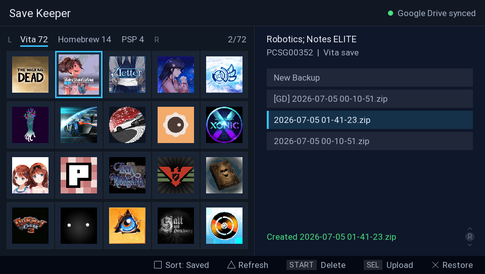
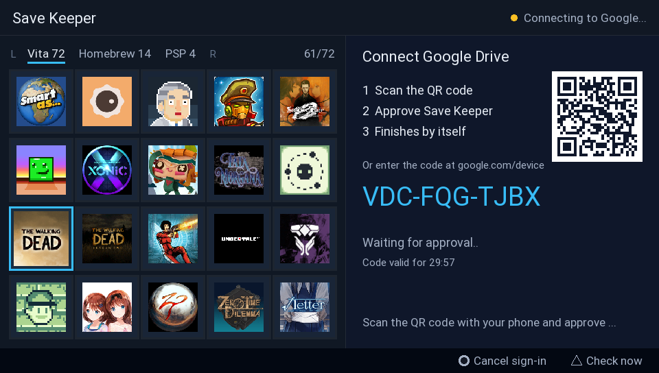
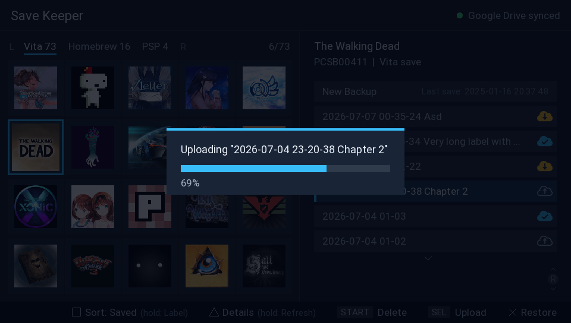
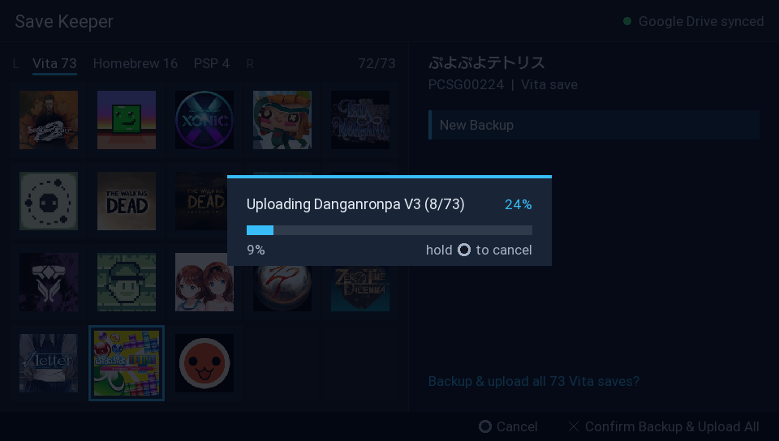
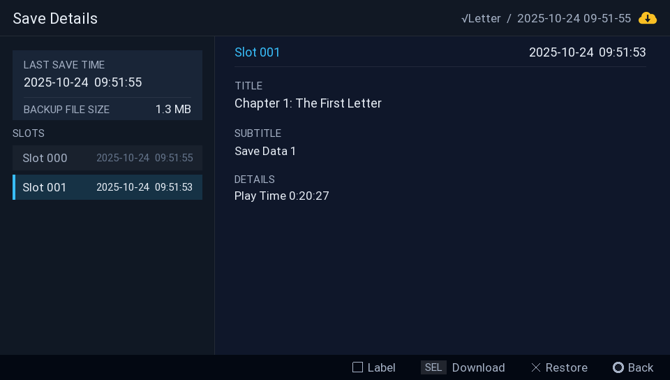
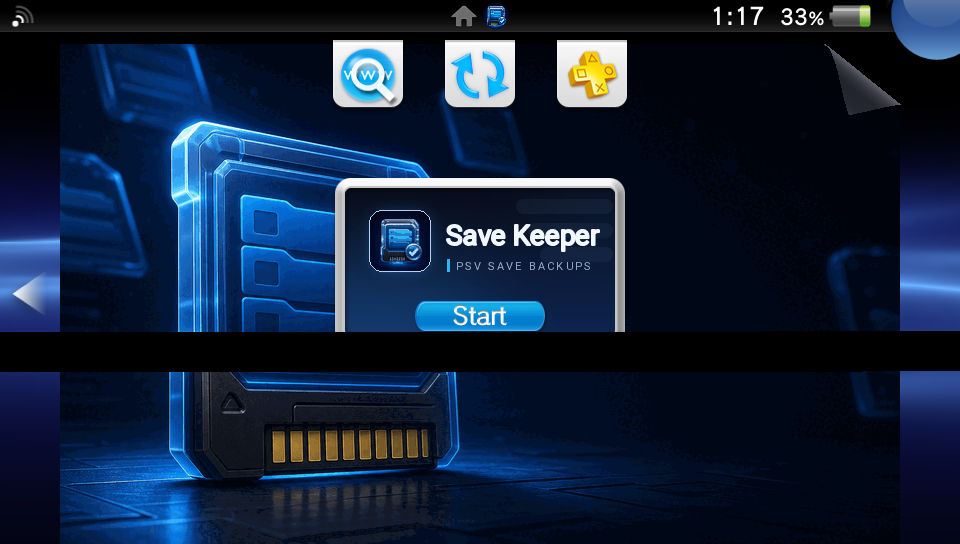

# Save Keeper

Back up your PS Vita and PSP save games and conveniently sync them to your own
[Google Drive](docs/google-drive-setup.md).
Keep your saves safe in the cloud, go back to an older backup any time, and if you play on
more than one Vita (or a PS TV), your saves follow you.



## What it does

- creates timestamped ZIP backups of Vita, game card, and PSP/Adrenaline saves
- signs in to Google by scanning a QR code with your phone - no typing on the Vita.
  [Set it up once](docs/google-drive-setup.md) and it just works
- uploads backups to a `PSV Saves` folder in your own Google Drive
- downloads and restores backups on any of your devices, so a save made on one Vita can
  be picked up on another Vita or a PS TV (you can also download a copy without restoring)
- backs up and uploads a whole tab in one gesture - every game in the current tab, backed up
  and synced to Drive at once
- shows one row per backup, with a small cloud glyph marking where it lives - locally,
  on Google Drive, or both
- lets you label a backup ("before boss", "100% save") with the on-screen keyboard, so you can
  tell backups apart. The label follows the backup to Drive
- shows your games in a grid with real titles and icons, grouped into Vita / Homebrew / PSP tabs
- sorts by name, by latest backup (whatever was backed up most recently, from any device,
  bubbles to the top), or by last saved
- keeps multiple backups per game, so you can go back to an older save at any time
- names new backups from the latest real Vita save-slot time when the game provides it, instead
  of the time Save Keeper happened to run
- shows detailed info about a save and its backups on a dedicated details screen
- before a restore overwrites anything, the current save is backed up automatically (shown as
  `[AUTO]`), unless an identical backup already exists - so you never lose your current save
  to an accidental overwrite

| Google sign-in | Upload with progress |
| --- | --- |
|  |  |

| Back up & upload all saves at once | Save details |
| --- | --- |
|  |  |

## What you need

<table align="right"><tr><td align="center">
<br>
<sub><i>ai-slopified livearea banner</i></sub>
</td></tr></table>

- a PS Vita or PS TV with HENkaku / h-encore homebrew enabled
- "Enable unsafe homebrew" turned on in HENkaku settings (the app reads save folders and the
  system app database)
- VitaShell (or another way to install a VPK)
- a Google account and about ten minutes for the [one-time Google setup](docs/google-drive-setup.md)

## Install

1. copy `save-keeper.vpk` to your Vita (for example over FTP to `ux0:/data/`)
2. in VitaShell, press X on the file and confirm the install, including the extended
   permissions prompt
3. do the [one-time Google setup](docs/google-drive-setup.md), then launch Save Keeper from the
   LiveArea

## Google Drive setup (one time)

Follow the [Google Drive setup guide](docs/google-drive-setup.md).

## Controls

| Button | Action |
| --- | --- |
| D-Pad / Left stick | move through the game grid |
| L / R | switch between the Vita / Homebrew / PSP tabs |
| Right stick | move through the backup list |
| Cross | create a backup (on "New Backup") or restore the selected one (press twice) |
| Select | \- upload a local-only backup, or download a Drive-only one<br>\- hold to back up & upload the whole tab |
| Start | delete the selected backup - for one that is on both sides, choose local, Drive, or both |
| Square | \- change sorting (by name, latest backup, or last saved)<br>\- hold to label the selected backup |
| Triangle | \- view the focused save's slot details and sizes<br>\- hold to connect Google Drive or re-sync its backup list |
| Circle | cancel a pending confirmation or the Google sign-in |

On Japanese-region consoles Cross and Circle swap automatically, following the system setting.
Inside Save Details the same actions work on the inspected backup.

## Syncing between devices

Every device uses the same `google-client.json`: do the Google setup once, then just copy the
file to each of your devices and sign in to the same Google account.
All backups land in the same `PSV Saves/<game id> <game title>/` folders in your Drive, so a backup
uploaded from one Vita shows up on the others (marked with a Drive cloud) after a re-sync.
Restoring one downloads it first, then unpacks it over the save folder. You can also just
download a local copy without restoring. Labeling or renaming a backup updates its copy
on Drive too, so the two stay matched.

Deleting the last Drive backup of a game also removes its (empty) folder from Drive.

Restoring never destroys the save you had: if the current save is not already covered by one of
the local backups (compared by content, not by dates), an `[AUTO]` backup is created first.

Slot details are stored in a small optional JSON companion next to each ZIP, locally and on
Drive. The ZIP is always authoritative: a missing or damaged JSON file never hides a backup and
never prevents upload, download, restore, labeling, or deletion. Save Keeper reads details lazily
when you press Triangle, and can recover them from `sce_sys/sdslot.dat` inside older local ZIPs
without rewriting those ZIPs. Existing 1.0 backups keep their original names and work unchanged.

Saves of retail games are encrypted by the system, so Save Keeper uses a small kernel helper to
read the exact save dates out of them. When that helper is unavailable it falls back to the
file times of the save - nothing breaks, the dates are just approximate rather than exact. Recovering slot details from an already-encrypted backup
extracts it into `ur0:user/00/savedata` first, so that step needs enough free space on `ur0:` for
the save. It is skipped when the save is larger than the space available there, and the ZIP itself
is never touched.

## Where things are stored

| Path | Contents |
| --- | --- |
| `ux0:data/save-keeper/backups/` | local ZIP backups and optional JSON details, one folder per game |
| `ux0:data/save-keeper/google-client.json` | your OAuth client credentials |
| `ux0:data/save-keeper/google-token.json` | your sign-in - treat it like a password |
| `ux0:data/save-keeper/settings.txt` | app settings (sort mode) |
| `PSV Saves/` in your Google Drive | uploaded backups, one folder per game |

To disconnect a device, delete `google-token.json` and revoke the grant at
https://myaccount.google.com/permissions.

## Building from source

Host tests:

```sh
cmake -S . -B build/host
cmake --build build/host
ctest --test-dir build/host --output-on-failure
```

Vita VPK (needs [VitaSDK](https://vitasdk.org/)):

```sh
export VITASDK=/path/to/vitasdk
cmake -S . -B build/vita -DCMAKE_TOOLCHAIN_FILE="$VITASDK/share/vita.toolchain.cmake"
cmake --build build/vita
```

The VPK is written to `build/vita/save-keeper.vpk`. You can bake your Google credentials into
the build with `-DSAVE_KEEPER_GOOGLE_CLIENT_ID=...` and `-DSAVE_KEEPER_GOOGLE_CLIENT_SECRET=...`
instead of using `google-client.json`.

Project layout: `src/core` is portable logic covered by the host tests, `src/vita` is the app
loop and `vita2d` UI, `sce_sys` holds the package assets. LiveArea PNGs must stay 8-bit indexed
or VitaShell fails promotion with error `0x8010113D`.

## Acknowledgements

- [JKSV](https://github.com/J-D-K/JKSV) for the backup model inspiration
- `third_party/qrcodegen`: [QR Code generator](https://github.com/nayuki/QR-Code-generator)
  by Project Nayuki, MIT License
- `third_party/picojson`: [picojson](https://github.com/kazuho/picojson) by Kazuho Oku,
  BSD 2-Clause License, used for bounded metadata companions
- `third_party/vitasqlite`: [SQLite R/W override](https://github.com/VitaSmith/libsqlite) by
  VitaSmith, GPLv3 - the same approach VitaShell and Apollo Save Tool use to read the system
  app database
- HTTPS uses the [Mozilla CA bundle](https://curl.se/docs/caextract.html) packaged in the VPK,
  with TLS verification enabled

## License

GPLv3, see [LICENSE](LICENSE). The vendored SQLite override is GPLv3, which makes copyleft the
natural license for the whole project.
